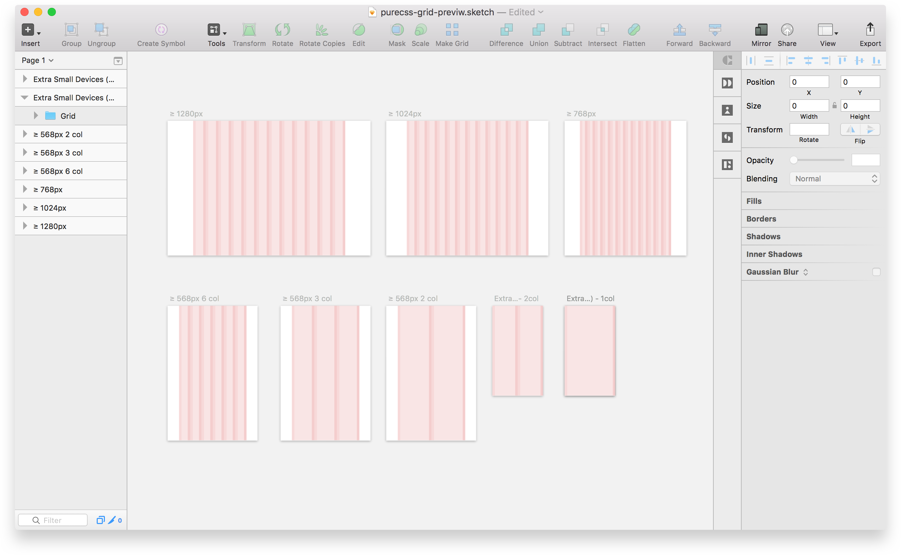

# Sketch 3 Purecss Grid Template

I haven't found another file so I have created this file. Use this as a starting point for designing a site in Sketch that will utilize the purecss.io

## Includes:

* Extra Small Devices    ( ≥ 320px 2col + 1 col )
* Small Device 2 (SM)    ( ≥ 568px 6 col + 3 col + 2 col )
* Small Device (MD)      ( ≥ 768px )
* Medium Device (LG)     ( ≥ 1024px )
* Large Device (XL)      ( ≥ 1280px )
* Grid for zeplin.io

